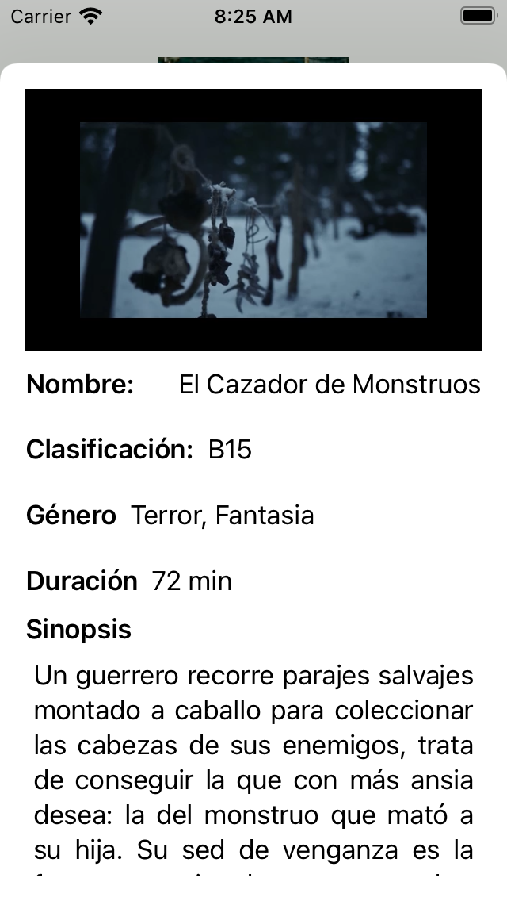

[![Swift Version][swift-image]][swift-url]

 

## Test Aspirantes iOS 📱

### OBJETIVO DEL DOCUMENTO

Evaluar los conocimientos técnicos del aspirante en el desarrollo de aplicaciones nativas.

 
 
 
 

Es hora de clonar el repositorio. Ingrese el siguiente comando:

`$ gh repo clone JosafatCMtz/Test-Aspirantes-Mobile`

[swift-image]: https://img.shields.io/badge/swift-5.0-orange.svg
[swift-url]: https://swift.org/
